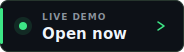
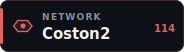
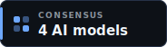
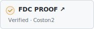
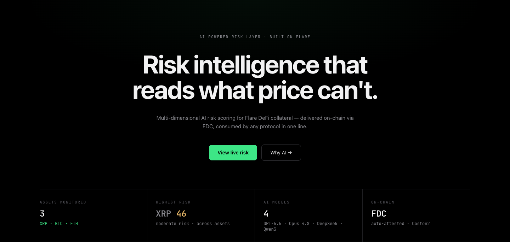
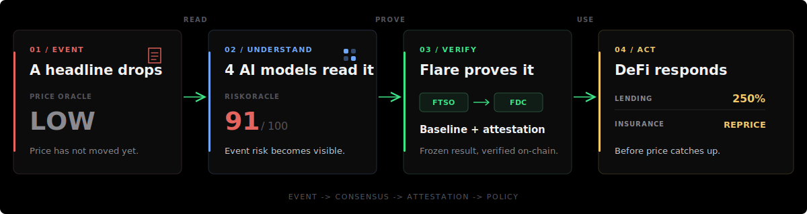
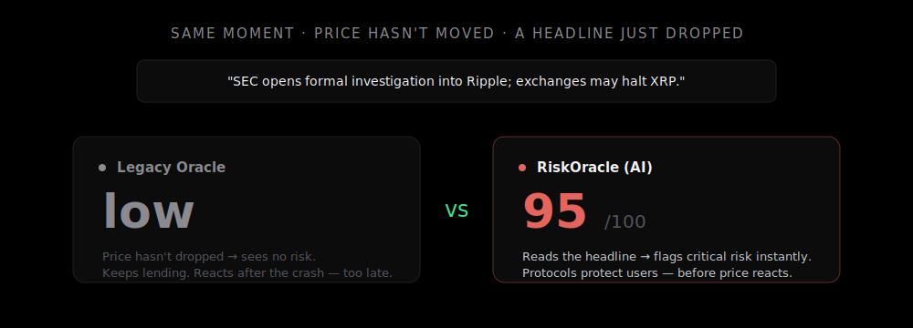
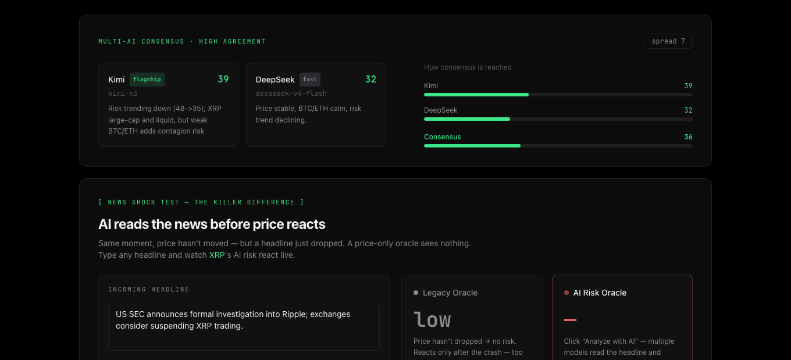
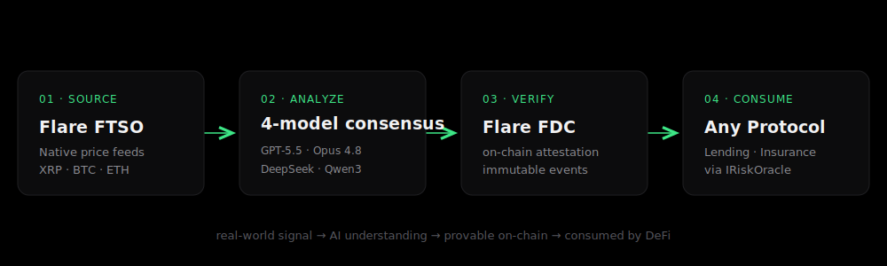
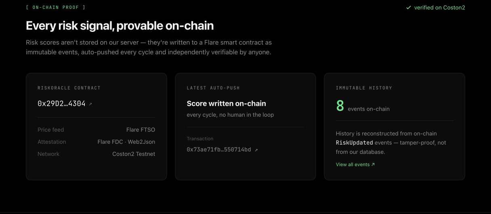

<div align="center">

# RiskOracle

### Four AI views. One Flare-native risk signal. Verifiable on-chain.

RiskOracle turns Flare market data and breaking events into an actionable,
contract-readable risk score for interoperable assets.

**Built for:** Flare lending markets, insurance pools, and protocols accepting
FXRP or other interoperable assets as collateral.

<p>
  <a href="https://flare-risk-oracle.onrender.com/"></a>
  <a href="https://coston2-explorer.flare.network/address/0x29D2567bbD5979426fadAdB8991C10dE267f4304"></a>
  
  <a href="https://coston2-explorer.flare.network/tx/0xe1aa6bf6d89a14422ce60af8646f8943676bcbc6de5c650a62ff3ea3268e69a7"></a>
</p>

### [Launch live app →](https://flare-risk-oracle.onrender.com/) · [Demo video (98s) →](https://github.com/ZOELIU2333/flare-risk-oracle/releases/tag/video-v1.0.0) · [Verify on-chain proof →](#on-chain-proof)

<sub>Hosted app: <a href="https://flare-risk-oracle.onrender.com/">flare-risk-oracle.onrender.com</a> · <a href="https://github.com/ZOELIU2333/flare-risk-oracle/releases/download/video-v1.0.0/RiskOracle-Flare-Summer-Signal.mp4">Download 1080p MP4</a> · No wallet or sign-in required</sub>

<sub>Flare Summer Signal · Bounty 1: Interoperable Asset Products · Built on Coston2</sub>

<br><br>

<a href="https://flare-risk-oracle.onrender.com/"></a>

<sub>Live product: three FTSO assets · four AI models · FDC proof · two protocol consumers</sub>

</div>

## From event to action in 30 seconds

<picture>
  <source media="(max-width: 600px)" srcset="docs/img/judge-path-mobile.svg">
  
</picture>

[Run the live shock test](https://flare-risk-oracle.onrender.com/) →
[inspect four-model consensus](#working-product) →
[verify the FDC proof](#on-chain-proof) →
[review the protocol policy](#from-signal-to-defi-action)

> **The product is not another market dashboard.** RiskOracle is a reusable risk
> primitive that lending markets and insurance pools can consume before a
> price-only liquidation rule reacts.

## The signal price misses



The dashboard's **News Shock Test** holds the live FTSO price constant while a
judge supplies an adverse event. The comparison isolates the product's core
advantage: understanding new information before it is fully priced in.

## Try it in 90 seconds

1. **Open the [live demo](https://flare-risk-oracle.onrender.com/)** and switch between XRP, BTC, and ETH.
2. **Run News Shock Test** with an event such as `A major exchange announces an immediate halt of XRP withdrawals.`
3. **Verify the result** by opening the [oracle events](https://coston2-explorer.flare.network/address/0x29D2567bbD5979426fadAdB8991C10dE267f4304) and the [successful FDC proof transaction](https://coston2-explorer.flare.network/tx/0xe1aa6bf6d89a14422ce60af8646f8943676bcbc6de5c650a62ff3ea3268e69a7).

No wallet, API key, or local setup is required for evaluation.

Prefer a guided tour? **[Open the 98-second judge film release](https://github.com/ZOELIU2333/flare-risk-oracle/releases/tag/video-v1.0.0)** to see the unchanged FTSO price, four-model consensus, FDC proof, and protocol response as one continuous flow. The release provides the [1080p MP4](https://github.com/ZOELIU2333/flare-risk-oracle/releases/download/video-v1.0.0/RiskOracle-Flare-Summer-Signal.mp4) and its SHA-256 digest.

## Working product

<div align="center">



<sub>One live input, four independent assessments, one visible consensus, and an auditable spread.</sub>

</div>

| Live capability | What is implemented | Where to verify |
|---|---|---|
| **Flare-native prices** | XRP/USD, BTC/USD, and ETH/USD are read from FTSOv2 through Flare's Contract Registry. | [`server/ftso.js`](server/ftso.js) |
| **Four-model consensus** | GPT-5.5, Claude Opus 4.8, DeepSeek, and Qwen3-235B run independently and in parallel. | [`lib/risk-analyzer.js`](lib/risk-analyzer.js) |
| **Uncertainty-aware score** | The engine exposes model divergence; when spread exceeds `25`, uncertainty shifts consensus toward the higher-risk result. | [`lib/consensus.js`](lib/consensus.js) |
| **Event-aware analysis** | A user-supplied headline is evaluated against the current FTSO price. | [`risk-strategies/news-analysis.js`](risk-strategies/news-analysis.js) |
| **On-chain operation** | XRP risk updates emit `RiskUpdated`; `/api/onchain-history` rebuilds history from contract logs. | [`server/onchain.js`](server/onchain.js) |
| **Protocol consumption** | Lending and insurance examples depend only on the stable `IRiskOracle` interface. | [`contracts/IRiskOracle.sol`](contracts/IRiskOracle.sol) |

### Consensus, precisely

All providers receive the same structured risk prompt; none sees another model's
answer. Successful scores are averaged. A spread above `25` is treated as a risk
signal and moves the output halfway from the mean toward the maximum.

The provider layer uses `Promise.allSettled` and bounded retries. Scheduled
analysis can reuse a provider's last successful result during a temporary outage;
the one-off News Shock Test reaches consensus only from current successful
responses. A partial provider failure therefore remains visible without taking
the product down.

## Flare-native architecture



| Stage | Flare / system role | Why it matters |
|---|---|---|
| **01 · Source** | FTSOv2 supplies native XRP, BTC, and ETH market data; events add unstructured context. | The risk engine starts from a Flare-verifiable price baseline. |
| **02 · Analyze** | Four models score market, volatility, liquidity, contagion, and event risk. | Independent opinions reduce dependence on one provider and expose disagreement. |
| **03 · Verify** | The result is frozen as deterministic JSON before FDC Web2Json attestation. | FDC providers retrieve identical bytes and contracts verify the proof. |
| **04 · Consume** | `IRiskOracle` presents one stable interface to downstream contracts. | Protocols choose policy thresholds without integrating any AI vendor. |

### Why the deterministic snapshot is important

LLM responses are non-deterministic; FDC data providers need identical response
bytes. RiskOracle separates **analysis** from **attestation**: AI computes once,
the output is frozen, and FDC attests that immutable snapshot. This boundary is
what makes an AI-to-FDC pipeline reproducible.

### Two honest on-chain paths

| Path | Purpose | Evidence |
|---|---|---|
| **FDC attestation** | Verifies and decodes a deterministic Web2Json proof in `RiskOracleFdc`. | [Contract](https://coston2-explorer.flare.network/address/0x48908a0246Db6E3B21E9c2CeDEc08c88F74Cf3Fb) · [proof transaction](https://coston2-explorer.flare.network/tx/0xe1aa6bf6d89a14422ce60af8646f8943676bcbc6de5c650a62ff3ea3268e69a7) |
| **Continuous demo** | Owner-signs fresh XRP scores to a lightweight oracle for rapid iteration and visible event history. | [Operational oracle](https://coston2-explorer.flare.network/address/0x29D2567bbD5979426fadAdB8991C10dE267f4304) · [`RiskUpdated` source](contracts/RiskOracle.sol) |

The end-to-end FDC path is proven on Coston2. The continuous path keeps the
hosted hackathon demo responsive; moving all scheduled updates to FDC is the
first production milestone.

## From signal to DeFi action

Both example protocols integrate the same interface:

```solidity
RiskData memory risk = riskOracle.getLatest();
```

| Risk score | FXRP lending example | Insurance example |
|---|---|---|
| **Below 50** | `150%` collateral; borrowing open | Lower risk-adjusted premium; underwriting open |
| **50-79** | `250%` collateral | Premium rises linearly with risk |
| **80-89** | New borrowing suspended | High premium; underwriting remains open |
| **90-100** | New borrowing suspended | New underwriting suspended |

This is the interoperability thesis: a protocol integrates a transparent
on-chain signal, not an AI provider, and retains control over its own policy.

## On-chain proof

| Artifact | Verifiable Coston2 record |
|---|---|
| **Operational risk oracle** | [`0x29D2567bbD5979426fadAdB8991C10dE267f4304`](https://coston2-explorer.flare.network/address/0x29D2567bbD5979426fadAdB8991C10dE267f4304) |
| **FDC-verifying oracle** | [`0x48908a0246Db6E3B21E9c2CeDEc08c88F74Cf3Fb`](https://coston2-explorer.flare.network/address/0x48908a0246Db6E3B21E9c2CeDEc08c88F74Cf3Fb) |
| **Successful FDC submission** | [`0xe1aa6bf6...8e69a7`](https://coston2-explorer.flare.network/tx/0xe1aa6bf6d89a14422ce60af8646f8943676bcbc6de5c650a62ff3ea3268e69a7) |
| **Network** | Coston2 testnet · chain ID `114` |

<div align="center">



</div>

## Hackathon fit

| Official judging criterion | Concrete evidence in this submission |
|---|---|
| **Product usefulness** | Gives FXRP lending markets and insurance pools an early-warning risk signal before event risk is fully reflected in price. |
| **Flare integration quality** | Direct FTSOv2 reads, FDC Web2Json verification, deployed Coston2 contracts, and a concrete FAssets/FXRP collateral use case. |
| **Technical execution** | A working hosted demo, four-provider consensus, divergence policy, deterministic snapshots, RPC fallback, event-derived history, and two contract consumers. |
| **Evidence of new work** | The contracts, AI engine, Flare integrations, API, dashboard, and protocol demos were built during Flare Summer Signal. |
| **Clarity and future potential** | One stable oracle interface can serve multiple protocols; the roadmap advances from the proven prototype to scheduled FDC updates, live FXRP integration, audits, and an SDK. |

### Validation and distribution status

The product is publicly testable through the hosted demo and independently
inspectable through Coston2. It does **not** claim production users, signed pilots,
or audited mainnet readiness yet. The next distribution milestone is a testnet
pilot with a Flare lending or insurance protocol using live FXRP contracts.

<details>
<summary><strong>Run locally</strong></summary>

### Requirements

- Node.js 20
- A compatible gateway key for GPT-5.5, Claude Opus 4.8, and Qwen3-235B
- A DeepSeek API key
- Optional: a funded Coston2 test wallet for automatic score submission

```bash
npm install
cp .env.example .env

# Add JDCLOUD_API_KEY and DEEPSEEK_API_KEY.
# Add PRIVATE_KEY only when enabling Coston2 auto-push.
npm start
```

Open [http://localhost:8078](http://localhost:8078). The Express service hosts
both the dashboard and API; credentials stay on the backend. Use only a dedicated
testnet wallet and never commit the populated `.env` file.

</details>

<details>
<summary><strong>API surface</strong></summary>

| Endpoint | Purpose |
|---|---|
| `GET /api/health` | Service status and supported assets |
| `GET /api/price?asset=XRP` | Latest FTSOv2 price |
| `GET /api/risk?asset=XRP` | Cached multi-model risk result |
| `GET /api/overview` | XRP/BTC/ETH summary |
| `POST /api/news` | Event-aware risk analysis |
| `POST /api/risk/refresh` | Trigger a background refresh |
| `GET /api/onchain-history` | History reconstructed from Coston2 events |

</details>

<details>
<summary><strong>Implementation map</strong></summary>

```text
frontend/index.html           Dashboard and News Shock Test
server/index.js               API, scheduler, cache, and persistence
server/ftso.js                FTSOv2 reads for XRP, BTC, and ETH
server/onchain.js             Score updates and event-derived history
lib/providers/                OpenAI, Anthropic, and DeepSeek adapters
lib/risk-analyzer.js          Four-provider parallel execution and fallback
lib/consensus.js              Consensus and divergence policy
risk-strategies/              Market, contagion, trend, and news prompts
contracts/IRiskOracle.sol     Stable protocol integration interface
contracts/RiskOracleFdc.sol   FDC Web2Json proof verification
contracts/MiniLending.sol     Risk-aware collateral and borrowing policy
contracts/InsurancePool.sol   Risk-aware pricing and underwriting policy
```

</details>

<details>
<summary><strong>New work vs. pre-existing work</strong></summary>

RiskOracle was started as a new project for Flare Summer Signal. Before the
hackathon, this application, its contracts, and its Flare integrations did not
exist. Work completed during the program includes:

- Direct FTSOv2 integration for three assets with RPC fallback.
- Four model adapters across OpenAI-compatible and Anthropic request formats.
- Parallel consensus, divergence-aware scoring, retry backoff, and scheduled fallback.
- Market, cross-asset contagion, trend, and news-event analysis strategies.
- Deterministic snapshots and an end-to-end FDC Web2Json proof flow.
- `IRiskOracle`, `RiskOracleFdc`, `MiniLending`, and `InsurancePool` contracts.
- Automatic Coston2 updates and history rebuilt from contract events.
- A hosted backend API and interactive multi-asset dashboard.

No company code or proprietary dataset was used. Inference uses model APIs;
market data comes from Flare FTSO; the demo uses public/test data.

</details>

## Prototype scope and next steps

This is hackathon software, not audited production infrastructure. One provider
may be rate-limited during a request, which is why source participation and
model spread remain visible. The FDC path is proven with a successful Coston2
transaction; scheduled demo updates currently use an owner signer for speed.

1. Route every scheduled production update through FDC attestation.
2. Bind the consumers to deployed FXRP token contracts and pilot with a Flare protocol.
3. Add signed source snapshots, historical model calibration, explicit quorum rules, and provider weighting.
4. Audit the contracts and publish an SDK plus risk-policy governance process.

---

<div align="center">

**FTSOv2 · FDC Web2Json · FXRP · GPT-5.5 · Claude Opus 4.8 · DeepSeek · Qwen3-235B**

### Because the most dangerous risk is the one an oracle cannot see.

[Live demo](https://flare-risk-oracle.onrender.com/) ·
[Judge film](https://github.com/ZOELIU2333/flare-risk-oracle/releases/tag/video-v1.0.0) ·
[Source code](https://github.com/ZOELIU2333/flare-risk-oracle) ·
[FDC proof](https://coston2-explorer.flare.network/tx/0xe1aa6bf6d89a14422ce60af8646f8943676bcbc6de5c650a62ff3ea3268e69a7) ·
[Hackathon page](https://dorahacks.io/hackathon/flaresummersignal/detail)

</div>
